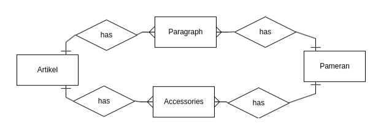

# Database Design - KKN Neira Basudara

Desain database untuk proyek web KKN Neira Basudara menggunakan empat entitas utama: Artikel, Pameran, Paragraph, dan Accessories. Setiap entitas ini dirancang untuk mendukung fitur-fitur yang ada di dalam aplikasi, seperti publikasi artikel dan pameran karya.

## Entitas dan Relasi

### 1. Artikel

Entitas **Artikel** digunakan untuk menyimpan data artikel yang dipublikasikan di website. Artikel memiliki relasi _one-to-many_ dengan **Paragraph** dan **Accessories**, yang berarti satu artikel dapat memiliki banyak paragraf dan aksesori.

### 2. Pameran

Entitas **Pameran** memiliki struktur yang hampir sama dengan entitas Artikel, tetapi digunakan untuk menyimpan daftar karya yang dipamerkan di kegiatan pameran. Pameran juga memiliki relasi _one-to-many_ dengan **Paragraph** dan **Accessories**.

### 3. Paragraph

Entitas **Paragraph** digunakan untuk menyimpan setiap paragraf yang ada di artikel atau pameran. Setiap paragraf terhubung dengan artikel atau pameran melalui `artikelId`.

### 4. Accessories

Entitas **Accessories** digunakan untuk menyimpan data tentang aksesori yang mungkin muncul di artikel atau pameran, seperti foto. Setiap aksesori terhubung dengan artikel atau pameran melalui `artikelId`.

## Entity Relationship Diagram (ERD)

Berikut adalah representasi visual dari relasi antara entitas dalam database:

